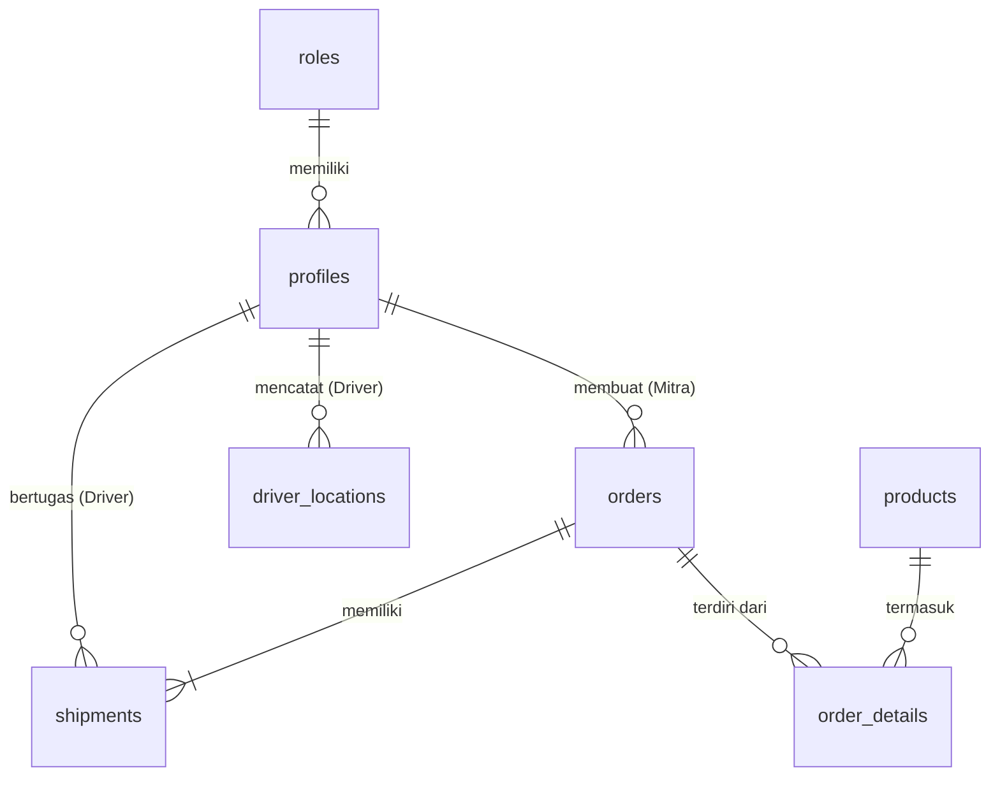

# Aplikasi Mobile Pemesanan dan Penjualan Cangkang Kelapa Sawit

[](https://flutter.dev)
[](https://supabase.com)
[](https://dart.dev)

## Deskripsi Proyek

Aplikasi mobile B2B untuk PT. Fujiyama Biomass Energy yang mengelola pemesanan dan penjualan cangkang kelapa sawit dengan fitur tracking progres real-time menggunakan GPS.

### 🎯 Tujuan Utama

- Digitalisasi proses pemesanan cangkang kelapa sawit
- Tracking pengiriman real-time dengan GPS
- Sistem multi-role (Admin, Mitra Bisnis, Logistik/Driver)
- Upload dan manajemen dokumen (Surat Jalan, Bukti Kirim)
- Partial acceptance untuk fleksibilitas pesanan

## 🏗️ Arsitektur Sistem

### Backend as a Service (BaaS)

- **Backend**: Supabase
- **Database**: PostgreSQL (Supabase)
- **Storage**: Supabase Storage
- **Authentication**: Supabase Auth
- **Real-time**: Supabase Realtime

### Frontend

- **Framework**: Flutter
- **State Management**: Riverpod
- **UI Framework**: Material Design 3
- **Maps**: flutter_map (OpenStreetMap)
- **Responsive Design**: flutter_screenutil

## 📋 Fitur Utama

### 🔐 Sistem Multi-Role

1. **Admin**

   - Kelola master data produk
   - Konfirmasi pesanan dengan partial acceptance
   - Assign driver dan upload surat jalan
   - Monitoring semua pengiriman

2. **Mitra Bisnis**

   - Membuat pesanan baru
   - Lihat riwayat pesanan
   - Tracking pengiriman real-time

3. **Logistik/Driver**
   - Lihat tugas pengiriman
   - GPS tracking otomatis
   - Upload bukti pengiriman

### 📦 Manajemen Pesanan

- Partial acceptance (terima sebagian pesanan)
- Upload dokumen surat jalan (PDF)
- Status tracking: Baru → Dikonfirmasi → Dikirim → Selesai

### 🗺️ Real-time Tracking

- GPS tracking otomatis setiap 30 detik
- Peta real-time dengan flutter_map
- Notifikasi status pengiriman

## 📊 Database Schema

### Tabel Utama

1. **roles** - Peran pengguna
2. **profiles** - Profil pengguna dengan relasi role
3. **products** - Master data produk cangkang sawit
4. **orders** - Data pesanan
5. **order_details** - Detail item pesanan
6. **shipments** - Data pengiriman
7. **driver_locations** - Tracking GPS driver

### ERD (Entity Relationship Diagram)



## 🚀 Setup & Installation

### Prerequisites

- Flutter SDK (3.9.2+)
- Dart SDK
- Android Studio / VS Code
- Git

### 1. Clone Repository

```bash
git clone <repository-url>
cd cangkang_sawit_app
```

### 2. Install Dependencies

```bash
flutter pub get
```

### 3. Setup Supabase

1. Buat project baru di [Supabase](https://supabase.com)
2. Jalankan script SQL di `supabase/schema.sql`
3. Update `lib/core/constants/app_constants.dart`:

```dart
static const String supabaseUrl = 'YOUR_SUPABASE_URL';
static const String supabaseAnonKey = 'YOUR_SUPABASE_ANON_KEY';
```

### 4. Setup Storage Buckets

Buat bucket di Supabase Storage:

- `surat-jalan` - untuk file PDF surat jalan
- `bukti-kirim` - untuk foto bukti pengiriman

### 5. Run Application

```bash
flutter run
```

## 📱 Struktur Proyek

```
lib/
├── core/
│   ├── constants/         # App constants & enums
│   └── services/         # Supabase service layer
├── features/
│   ├── auth/            # Authentication screens
│   ├── admin/           # Admin dashboard & features
│   ├── mitra/           # Mitra bisnis features
│   ├── driver/          # Driver/logistik features
│   └── tracking/        # Real-time tracking
├── shared/
│   ├── models/          # Data models
│   ├── repositories/    # Data access layer
│   ├── providers/       # Riverpod providers
│   └── widgets/         # Reusable widgets
└── main.dart           # App entry point

supabase/
└── schema.sql          # Database schema & setup
```

## 🔄 Alur Kerja Bisnis

### 1. Proses Pemesanan

```
Mitra Bisnis → Buat Pesanan → Admin Review → Konfirmasi (dengan/tanpa Partial) → Siap Kirim
```

### 2. Proses Pengiriman

```
Admin Assign Driver → Upload Surat Jalan → Driver Mulai → GPS Tracking → Upload Bukti → Selesai
```

### 3. Real-time Tracking

```
Driver Start → Background GPS Service → Supabase Realtime → Update Peta → Notifikasi
```

## 🛠️ Dependencies Utama

```yaml
dependencies:
  flutter_riverpod: ^2.4.9 # State management
  supabase_flutter: ^2.1.0 # Backend integration
  flutter_map: ^6.1.0 # Maps
  geolocator: ^10.1.0 # GPS location
  flutter_background_service: ^5.0.5 # Background GPS
  file_picker: ^6.1.1 # File operations
  image_picker: ^1.0.4 # Camera integration
  flutter_screenutil: ^5.9.0 # Responsive design
```

## 🧪 Testing

```bash
# Run unit tests
flutter test

# Run integration tests
flutter drive --target=test_driver/app.dart

# Code coverage
flutter test --coverage
```

## 📝 API Endpoints (Supabase)

### Authentication

- `POST /auth/v1/signup` - Register user
- `POST /auth/v1/token` - Login
- `POST /auth/v1/logout` - Logout

### Data Tables

- `GET /rest/v1/orders` - Get orders
- `POST /rest/v1/orders` - Create order
- `PATCH /rest/v1/orders` - Update order
- `GET /rest/v1/shipments` - Get shipments
- `POST /rest/v1/driver_locations` - Insert GPS location

### Storage

- `POST /storage/v1/object/surat-jalan` - Upload surat jalan
- `POST /storage/v1/object/bukti-kirim` - Upload bukti kirim

## 🔐 Security & Permissions

### Row Level Security (RLS)

- Users hanya bisa akses data sesuai role
- Mitra Bisnis hanya lihat pesanan sendiri
- Driver hanya lihat tugas yang ditugaskan
- Admin akses penuh

### Required Permissions

- **Android**:
  - `ACCESS_FINE_LOCATION`
  - `ACCESS_COARSE_LOCATION`
  - `CAMERA`
  - `WRITE_EXTERNAL_STORAGE`

## 🚀 Deployment

### Build APK

```bash
flutter build apk --release
```

### Build App Bundle

```bash
flutter build appbundle --release
```

## 📖 User Guide

### Login Credentials (Testing)

- **Admin**: admin@fujiyama.com / admin123
- **Mitra**: mitra@example.com / mitra123
- **Driver**: driver@example.com / driver123

### Admin Workflow

1. Login sebagai Admin
2. Kelola master data produk
3. Review & konfirmasi pesanan baru
4. Assign driver dan upload surat jalan
5. Monitor tracking pengiriman

### Mitra Bisnis Workflow

1. Login sebagai Mitra Bisnis
2. Buat pesanan baru
3. Lihat status pesanan
4. Track pengiriman real-time

### Driver Workflow

1. Login sebagai Driver
2. Lihat tugas pengiriman
3. Mulai pengiriman (GPS auto-track)
4. Upload bukti tiba di tujuan

## 🤝 Contributing

1. Fork the project
2. Create feature branch (`git checkout -b feature/AmazingFeature`)
3. Commit changes (`git commit -m 'Add AmazingFeature'`)
4. Push to branch (`git push origin feature/AmazingFeature`)
5. Open Pull Request

## 📄 License

This project is licensed under the MIT License - see the [LICENSE](LICENSE) file for details.

## 👥 Team

- **Project**: Skripsi - Perancangan Aplikasi Mobile
- **Company**: PT. Fujiyama Biomass Energy
- **Tech Stack**: Flutter + Supabase
- **Development**: 2025

## 📞 Support

Untuk support atau pertanyaan, silakan hubungi:

- **Email**: support@fujiyama.com
- **Phone**: +62 xxx-xxxx-xxxx

---

⭐ **Star this repo if you find it helpful!**
